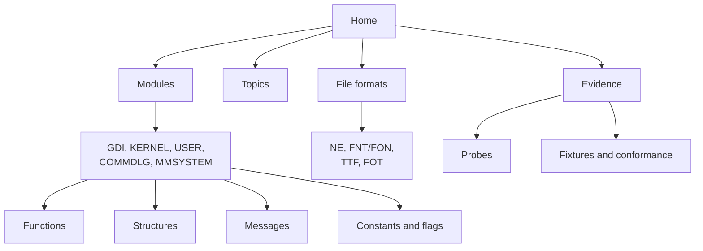
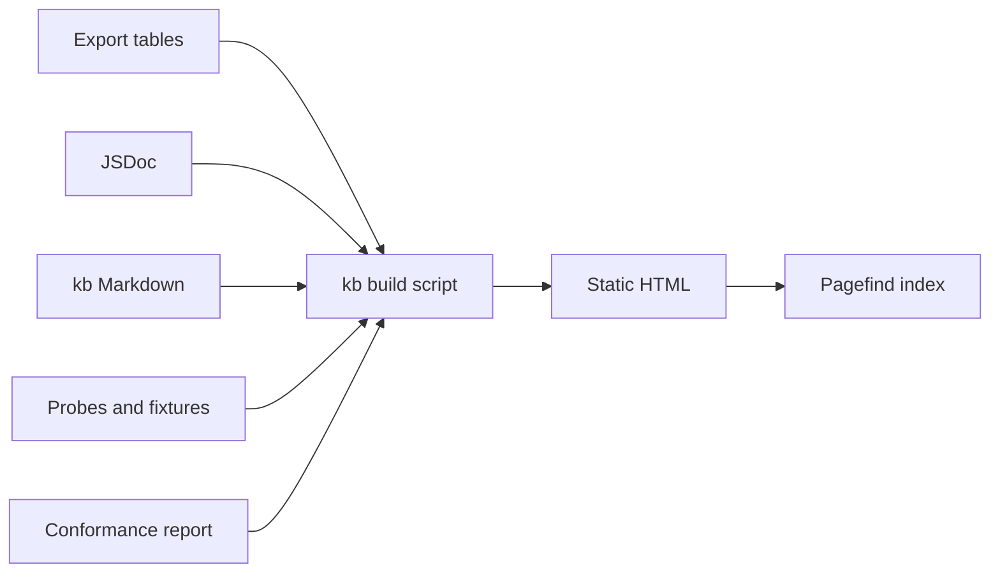

# Windows 3.1 API Knowledge Base — Design Spec

2026-09-24

A static, versioned website that documents every Windows 3.1 API winbox.js implements — each library, function, structure, message and file format — with what Microsoft documented, what Windows was measured to do, and where in its binaries that behaviour lives, every claim cited to a reproducible probe.

## Audience and goals

The readers are people rebuilding or preserving Windows 3.1 software — emulator authors, reverse engineers, archivists — who need to know what an API actually did, not only what its manual said.

They come with questions like these, and every page should answer them without opening the repository:

- What does `GetTextExtent` return for a turned bold string on a Hercules, and why?
- Which parts of a function's behaviour are documented, which were measured, and which were read out of `GDI.EXE`?
- Can I reproduce the measurement myself, and with what probe?
- How complete is winbox.js's implementation, and where does it still disagree with Windows?

The site is **not** a copy of the Windows SDK reference, a tutorial for writing Win16 programs, or a mirror of disassembly. It links to the SDK's own wording where that exists and adds what the SDK leaves out.

## Information architecture

The site is organised the way Windows 3.1 itself is: by module, then by what each module exports or defines. Topic pages sit beside that tree for behaviour that crosses functions — font mapping touches `CreateFontIndirect`, `TextOut` and `GetTextMetrics` at once.



Each node is one kind of page:

| Page kind    | One per                 | Example                     | URL                             |
| ------------ | ----------------------- | --------------------------- | ------------------------------- |
| Module       | DLL or EXE              | GDI                         | `/gdi/`                         |
| Function     | exported entry          | `GetGlyphOutline` (GDI.309) | `/gdi/getglyphoutline/`         |
| Structure    | struct type             | `GLYPHMETRICS`              | `/gdi/structures/glyphmetrics/` |
| Message      | window message          | `WM_PAINT`                  | `/user/messages/wm_paint/`      |
| Constant set | related flags           | `TA_*` text alignment       | `/gdi/constants/ta/`            |
| File format  | on-disk format          | `.FOT` font resource stub   | `/formats/fot/`                 |
| Topic        | cross-cutting behaviour | Synthetic bold              | `/topics/synthetic-bold/`       |
| Probe        | oracle program          | `smearmod`                  | `/evidence/probes/smearmod/`    |

Every function page also records its ordinal and the number of argument bytes it pops, because both are facts an emulator needs and both are checked against the real binaries.

## Page anatomy

Every function page has the same eight parts in the same order, so a reader learns the layout once. Structure, message and format pages use the subset that applies.

| #   | Section            | What it holds                                                                                                         | Where it comes from today                                                                          |
| --- | ------------------ | --------------------------------------------------------------------------------------------------------------------- | -------------------------------------------------------------------------------------------------- |
| 1   | Header             | Name, module, ordinal, argument bytes, and a status badge and conformance score for each of Windows 3.0, 3.1 and 3.11 | Export tables in `src/win16/*.ts`, the argument-bytes test, the conformance suite                  |
| 2   | Signature          | C prototype and parameter table with Win16 types                                                                      | JSDoc `@param` / `@return` on each implementation                                                  |
| 3   | Summary            | Two or three sentences on what the call is for                                                                        | JSDoc description                                                                                  |
| 4   | Observed behaviour | What Windows 3.1 was measured to do, rule by rule, each rule tagged with its evidence                                 | FONTS.md sections and the **Measured** / **Recorded** / **Read out** paragraphs in source comments |
| 5   | Nuances            | Edge cases and divergences from the SDK text: display differences, rounding, undocumented quirks                      | Same, filtered to the surprising                                                                   |
| 6   | Inside Windows     | Where the behaviour lives in the binaries, as module, segment and offset                                              | Offsets such as `GDI.EXE seg16:0030` already cited throughout                                      |
| 7   | Evidence           | Probes that exercise it, fixtures, record counts, per-display agreement, refused alternatives with their counts       | `oracle/probes`, `oracle/fixtures`, the conformance summary                                        |
| 8   | Implementation     | How winbox.js does it, with a link to the source file and to known gaps                                               | `src/`, `KNOWN_GAPS` in `test/oracle/replay.ts`                                                    |

Each version's status badge takes one of four values: **Exact** (every recorded case agrees), **Partial** (implemented, with open gaps), **Stub** (declared, not implemented), **Unrecorded** (implemented but no probe asks it yet).

## Evidence model

Every behavioural claim carries a label saying how we know it, and a citation a reader can follow. This is what separates the site from a restated manual.

| Label      | Meaning                                                                 | Required citation                                              | Example                                                                    |
| ---------- | ----------------------------------------------------------------------- | -------------------------------------------------------------- | -------------------------------------------------------------------------- |
| Documented | Microsoft's SDK says so                                                 | Link or reference to the SDK entry                             | `GetTextExtent` returns width in the low word                              |
| Measured   | A probe recorded Windows doing it, and the rule reproduces every record | Probe name, fixture, record count, agreement (e.g. 216 of 216) | A turned extent on a Hercules is the truncated length of the baseline step |
| Read out   | Found in the Windows binary and confirmed against recordings            | Module, segment and offset                                     | `GDI.EXE seg1 6fa3` stretches the across entries by H/V                    |
| Inferred   | Fits the recordings, but the code has not been read                     | Probe and count, plus what would settle it                     | The four bytes after the `.FOT` copyright string are leftover buffer       |
| Refused    | An alternative rule that was tested and lost                            | Its score against the winner                                   | Rounding the square root: 215 of 216                                       |

Refused alternatives are published, not hidden. They are what stops the next reader re-trying a reading already ruled out, and they are how FONTS.md is written today.

Citations resolve to pages on the site: a probe page shows its C source, how to build and record it, the fixture's arguments and results, and which functions cite it.

## Sources and build

Recommendation: keep every word of content in this repository, next to the code it describes, and generate the site from it with one Node build script, Pagefind for search and Mermaid for diagrams. Nothing is written twice.

Four sources feed the build:

1. **The survey of the binaries** — `scripts/kb/survey.mjs` reads the entry and name tables of the installed Windows libraries into `kb/data/exports-<version>.json`, committed so the site builds without the media. It decides which exports exist: our tables carry placeholders and a few wrong names, so they are not the authority.
2. **Export tables and JSDoc** — `src/win16/<module>.ts` says, where it names the same export at the same ordinal, whether it is implemented and how many bytes it pops; the implementation's JSDoc gives signature, parameters and summary. Where a table disagrees with the survey, the page says so.
3. **Knowledge pages** — a new `kb/` directory of Markdown files, one per function, structure, format or topic, holding sections 4 to 6 and 8 of the page anatomy. FONTS.md is split into these rather than duplicated.
4. **Evidence** — `oracle/probes/*.c` and `oracle/fixtures/*.json`, plus a JSON report the conformance suite writes on each run (per probe, function and display: agreed, disagreed, unsupported).

Each knowledge page starts with front matter the build validates:

```yaml
---
kind: function
module: GDI
name: GetGlyphOutline
ordinal: 309
versions:
  '3.0': unrecorded
  '3.1': exact
  '3.11': unrecorded
probes: [smearglf]
source: src/win16/gdi/GetGlyphOutline.ts
topics: [turned-text, synthetic-bold]
---
```



The build fails when a page cites a probe, offset or function that does not exist, and when a status badge disagrees with the conformance report. That keeps the site honest as the code moves. A GitHub Actions workflow runs the build and publishes the result to GitHub Pages from this repository.

## Boundaries

The site publishes our own descriptions, measurements and citations. It never publishes other people's code or text, and the build enforces the checkable parts.

| Material                                                                    | Rule                                                                                                                                                        |
| --------------------------------------------------------------------------- | ----------------------------------------------------------------------------------------------------------------------------------------------------------- |
| Microsoft SDK reference text                                                | Link to it or paraphrase; never copy entries wholesale                                                                                                      |
| Windows binaries, fonts, drivers                                            | Never published; pages cite module, segment and offset only                                                                                                 |
| Disassembly                                                                 | A few instructions quoted where they are the evidence (`cmp word [bp-0xe0],0x226`); never listings                                                          |
| Third-party scaler sources (`fontinstructions.c`, `scanlist.c`, `spline.c`) | Never quoted or linked; they stay untracked and outside the build's inputs                                                                                  |
| Probe sources and fixtures                                                  | Published under CC BY-SA; they are ours, and they are what makes every claim reproducible. Glyph bitmaps are shown where they are the evidence, as fair use |
| winbox.js source                                                            | Linked from each page under the repository's licence                                                                                                        |

The build reads only tracked files, so an untracked source cannot leak into a page by accident.

## What we can contribute today

The fonts-and-text part of GDI is ready to publish almost as it stands: FONTS.md alone is 20,199 lines in 260 sections, every rule in it measured or read out, and every recorded case agrees. The rest of the API has declarations and JSDoc but little behavioural material yet.

| Asset                                                        | Size today                                                                                                  | Becomes                                                                   |
| ------------------------------------------------------------ | ----------------------------------------------------------------------------------------------------------- | ------------------------------------------------------------------------- |
| FONTS.md                                                     | 20,199 lines, 260 sections                                                                                  | About 40 topic pages and the Observed behaviour of ~15 GDI function pages |
| FONT_PSEUDOCODE.md, FONT_SCALER.md, FONT_PIXEL_CANDIDATES.md | 5,451 lines together                                                                                        | Topic pages on TrueType scaling and rasterisation                         |
| ARCHITECTURE.md                                              | 375 lines                                                                                                   | An "About winbox.js" page                                                 |
| Oracle probes (`oracle/probes`)                              | 62 C programs                                                                                               | 62 probe pages with build and record steps                                |
| Fixtures (`oracle/fixtures`)                                 | 413 files, 1,137,028 records, 4 displays (VGA, EGA, Super VGA, Hercules)                                    | Evidence tables and per-display agreement on every page                   |
| Conformance suite                                            | 4,338 passing tests, `KNOWN_GAPS` empty                                                                     | Status badges and scores                                                  |
| Windows 3.1 exports, surveyed from its binaries              | 1,623 across 16 libraries; winbox.js implements 143                                                         | One page each, with signature and summary where implemented               |
| Export-table disagreements with Windows                      | 7, including an implemented SetBkMode at GDI.487, an ordinal Windows does not export                        | Listed on module pages; a test keeps the list from growing                |
| Decoded file formats                                         | `.FOT` byte for byte; NE via `scripts/oracle/ne.mjs`; FNT/FON strikes; the TrueType tables the scaler reads | Four format pages                                                         |
| Binary read-outs                                             | Offsets in `GDI.EXE` and `VGA.DRV` cited throughout FONTS.md                                                | Inside Windows sections                                                   |

The first function pages would be the ones whose behaviour is fully recorded: `TextOut`, `ExtTextOut`, `GetTextExtent`, `GetTextMetrics`, `GetCharWidth`, `CreateFontIndirect`, `SetTextAlign`, `SetTextCharacterExtra`, `SetBkMode`, `GetGlyphOutline`, `CreateScalableFontResource` and `GetRasterizerCaps`.

The first topic pages: the font mapper, TrueType scaling and hinting, scan conversion and dropout control, synthetic bold, synthetic italic, turned text, non-square pixels, the text ground and rules, and the display driver's `StrBlt`.

## Phases

Ship a small, complete slice first, fonts and text in GDI, because that is where the evidence already is, then widen.

| Phase             | Delivers                                                                                                                                           | Done when                                                                                      |
| ----------------- | -------------------------------------------------------------------------------------------------------------------------------------------------- | ---------------------------------------------------------------------------------------------- |
| 1. Skeleton       | `kb/` directory, front-matter schema, build script, module and function index generated from the export tables, every export as a header-only page | Every exported function of every module has a page with its ordinal, argument bytes and status |
| 2. Evidence       | Conformance suite writes a JSON report; probe and fixture pages; status badges and scores from the report                                          | Each badge matches the suite, and the build fails on a mismatch                                |
| 3. Fonts and text | FONTS.md split into topic pages; the 12 fully recorded GDI functions written out; `.FOT`, FNT/FON and NE format pages                              | Those pages cite only existing probes and offsets, checked by the build                        |
| 4. Public release | Search, cross-links, a contribution guide for adding a probe and a page                                                                            | A reader can reproduce any Measured claim from the site alone                                  |
| 5. Widen          | KERNEL and USER pages as their behaviour is recorded; FONTS.md stops growing and new findings land directly in `kb/`                               | Ongoing                                                                                        |

Phase 1 is built: `npm run kb` writes 1,633 pages for 17 modules to `dist/kb/` — every export of the 16 surveyed Windows 3.1 libraries, plus WinG from our table — and `test/kb/knowledge_base_test.ts` checks the pages against the survey and the tables.

Phase 2 is built: the conformance suite writes `kb/data/conformance.json` (96 fixtures, 173,497 records, none disagreeing; the 12,455 not replayed are the four instrument probes that read the scaler's memory), each of the 62 probes has a page, and the build refuses an `exact` or `partial` badge the report does not support.

Phase 3's content is written: page bodies render from Markdown with checked references and evidence labels, and there are 12 GDI text functions, nine topics (synthetic bold, synthetic italic, turned text, non-square pixels, the text ground and rules, polygon fill, the font mapper, TrueType scaling and hinting, scan conversion) and three formats (`.FOT`, `.FNT`/`.FON`, NE). Signatures show names and types only: the source's JSDoc descriptions follow the SDK's wording, which the site does not republish.

From phase 3 on, the working rule for new findings changes: a rule measured or read out goes straight into its `kb/` page, with its counts and refused alternatives, instead of into FONTS.md.

## Decisions

All six open questions are settled; each is folded into the sections above.

| Question                  | Decision                                                                                                                                               |
| ------------------------- | ------------------------------------------------------------------------------------------------------------------------------------------------------ |
| Hosting                   | GitHub Pages, built from this repository                                                                                                               |
| Content licence           | CC BY-SA for `kb/`, probe pages and published evidence; the code keeps its own licence                                                                 |
| Glyph bitmaps in fixtures | Published where they are the evidence for a claim and shown to demonstrate it, as fair use; not bulk dumps of a face                                   |
| Windows versions          | Pages are versioned by major release — 3.0, 3.1 and 3.11 — to show how each API evolved, toward deeper HLE compatibility; 3.1 is filled first          |
| FONTS.md                  | Stays, as the long-form working notes for the people doing the reverse engineering, and is kept in sync with `kb/`: a finding lands in both            |
| Stub pages                | Every declared export gets a page now, marked Stub, to show the scale and to record what is not yet known; the share of stubs is the completion signal |
