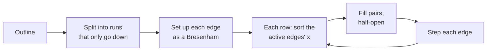

[[read out]] A VGA reports `POLYGONALCAPS` 8, scanlines alone, so GDI converts every polygon itself. `Polygon` is `GDI.EXE` ordinal 36 at seg24 `0000`; its conversion is bracketed by the driver's `Output` begin and end at seg24 `0bcb`, sets each edge up at `0b33` and `030e`, and walks the rows.

- [[read out]] An edge that is not horizontal runs from its upper point down to, but not including, its lower one.
- [[read out]] It is a Bresenham whose major axis is the longer of the two, with an error term of `2 * minor - major + bias`, where the bias is one — except for an edge whose major axis is `y` and which steps left, which gets nothing.
- [[read out]] Each row the active edges' `x` are sorted and handed to the driver in pairs, each pair half-open.
- [[read out]] Then each edge steps: a `y`-major one by one pixel if its error is positive; an `x`-major one by at least one, and on while its error stays at or below nought.

[[measured]] [[probe:polyfill]] draws 117 quadrilaterals under both fill modes — rectangles turned every five degrees, bands two and three pixels thick, and the corners of every turned ground [[probe:rotstyle]] drew — and this reproduces 234 of 234. [[refused]] Filling the pairs inclusively reproduces none.

## The outline

[[measured]] With a pen selected, [[fn:GDI.Polygon]] draws each edge the way [[fn:GDI.LineTo]] draws a line, with the last edge going back to the first point. The same probe draws all 117 quadrilaterals with a black pen, once over a null brush and once over a black brush, and winbox.js reproduces all 234. See [[topic:line-drawing]].

- [[measured]] The outline is not inside the fill. Across the 117 shapes, 3,602 of the 6,970 outline pixels lie where the fill leaves the page white, and every outline has some. [[inferred]] That fits a fill whose runs stop short of their right edge while the pen walks along the edge itself.
- [[measured]] With both a pen and a brush, the ink is exactly the fill and the outline added together, in all 117 records.
- [[measured]] For every one of these convex shapes, the two fill modes give the same ink.

Recorded on a VGA only. Not implemented: the winding rule, and `094f`'s handling of two edges meeting at a vertex, which no convex quadrilateral asks. The derivation is in [[fonts:8u]].
